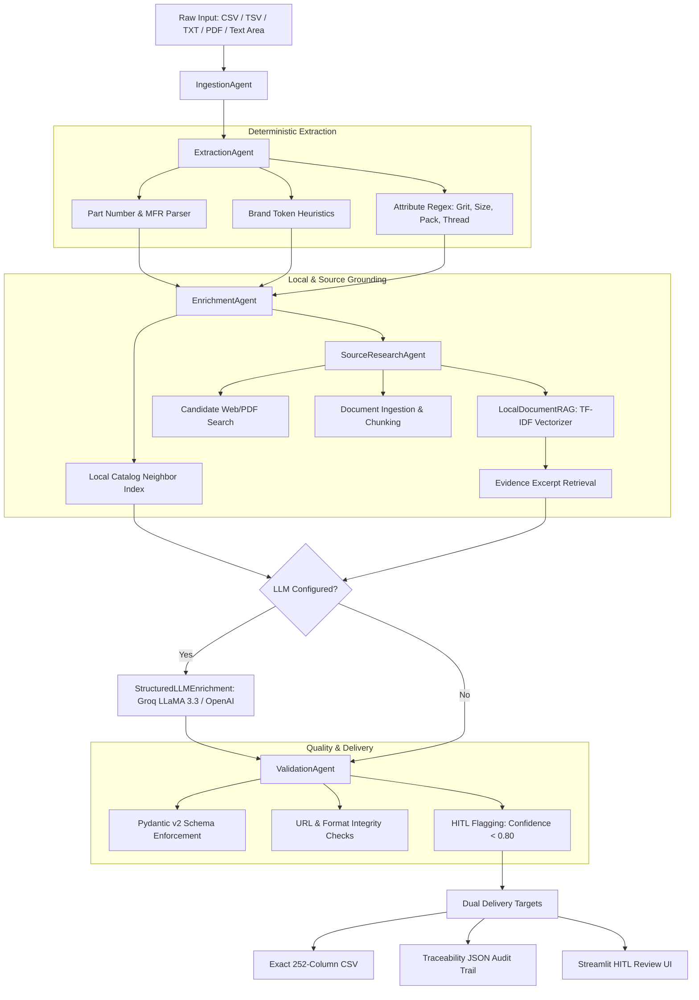
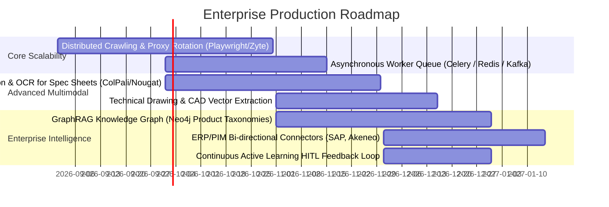

# UniHack 2026 — AI Product Intelligence & Catalog Enrichment Engine

[](https://www.python.org/)
[](https://fastapi.tiangolo.com)
[](https://streamlit.io)
[](https://docs.pydantic.dev/)
[](https://langchain.com)
[](https://groq.com)
[](LICENSE)

An enterprise-grade, source-grounded **Multi-Agent Product Intelligence Engine** designed to ingest raw, sparse, and inconsistent industrial product catalog feeds (6 columns) and automatically transform, enrich, ground, and validate them into an exact **252-column enterprise delivery schema** with complete end-to-end field provenance, TF-IDF document RAG, structured AI reasoning, and Human-in-the-Loop (HITL) quality control.

---

## 📌 Table of Contents

1. [The Problem & Solution](#-the-problem--solution)
2. [Key Capabilities](#-key-capabilities)
3. [System Architecture & Multi-Agent Flow](#-system-architecture--multi-agent-flow)
4. [In-Depth Technical Deep Dive (Why & How It Works)](#-in-depth-technical-deep-dive-why--how-it-works)
5. [Project Structure](#-project-structure)
6. [Installation & Setup](#-installation--setup)
7. [Running the System](#-running-the-system)
   - [1. Streamlit HITL Dashboard](#1-streamlit-hitl-dashboard)
   - [2. FastAPI Production Backend](#2-fastapi-production-backend)
   - [3. Batch CLI Runner](#3-batch-cli-runner)
   - [4. Verification & Audit Suite](#4-verification--audit-suite)
8. [API Endpoints Reference](#-api-endpoints-reference)
9. [Human-in-the-Loop (HITL) Workflow](#-human-in-the-loop-hitl-workflow)
10. [Evaluation & Benchmark Metrics](#-evaluation--benchmark-metrics)
11. [What Is Required Next (Production Roadmap)](#-what-is-required-next-production-roadmap)
12. [License](#-license)

---

## 🎯 The Problem & Solution

### The Challenge
In industrial supply chains, e-commerce, and enterprise Master Data Management (MDM/PIM), raw product feeds from distributors and manufacturers are notoriously fragmented:
* **Sparse inputs**: Catalogs typically provide only 6 noisy fields (`Mfg_Part_Num`, `Part_Desc`, `E1_Brand`, `Unilog_Brand`, `DIB_Brand`, `Part_Manuf`).
* **Massive output schema**: Target e-commerce channels require up to **252 standardized attribute columns** (dimensions, grit, thread sizes, URLs, classifications, technical specifications).
* **Hallucination hazard**: Pure generative LLMs frequently hallucinate exact part numbers, engineering dimensions, or non-existent brand names.
* **Compliance & auditability**: Regulated industries require strict provenance—every single generated cell must be traced back to verified source documentation.

### Our Solution
This engine solves the problem using a **multi-stage, source-grounded multi-agent architecture**:
1. **Deterministic Parsing First**: High-speed regex and token extractors extract physical attributes with 1.00 confidence.
2. **Local Catalog Resolution**: Cross-row TF-IDF and brand token inference resolve unbranded entries from neighboring catalog patterns.
3. **Autonomous Public Source Research & Local RAG**: Discovers manufacturer datasheets, fetches HTML/PDFs, chunks text, and retrieves evidence snippets via cosine-similarity TF-IDF.
4. **Constrained AI Reasoning**: Feeds retrieved evidence into Pydantic-constrained LLMs (Groq LLaMA 3.3 70B / OpenAI) to extract attributes without free-form hallucination.
5. **Strict 252-Column Schema Validation**: Enforces exact column order, validates URL formats, accounts for all missing data, and routes low-confidence fields (< 0.80) to a visual Human-in-the-Loop review UI.

---

## ✨ Key Capabilities

| Capability | Description |
|---|---|
| 📐 **Exact 252-Column Delivery Parity** | Outputs exactly match the header names, ordering, and structure of `Unihack_ExpectedOutput-DeliveryFormat.csv`. |
| 🛡️ **Zero-Hallucination Policy** | Unsupported or unverified fields default to clean `null` rather than fabricated guesswork. |
| 🔍 **Public Web & PDF Research** | Integrated scrapers fetch public technical datasheets, user manuals, and web listings for source grounding. |
| ⚡ **Local Document RAG** | Built-in TF-IDF vector index and chunk retriever that extracts verifiable evidence snippets without expensive vector DB overhead. |
| 🧠 **Ultra-Fast LLM Enrichment** | Leverages Groq-accelerated `llama-3.3-70b-versatile` with Pydantic JSON mode for lightning-fast structured reasoning. |
| 📊 **Complete Field Provenance** | JSON envelope provides `confidence_score`, `source`, `source_excerpt`, `reasoning`, and `status` for every single cell. |
| 🚦 **Interactive HITL Review** | Streamlit workbench highlights low-confidence cells (< 0.80) in yellow and provides an editable triage queue. |
| 🚀 **Production-Ready Dual Output** | Generates flat CSV for downstream ingestors and rich JSON for data governance audits. |

---

## 🏗️ System Architecture & Multi-Agent Flow



---

## 🔬 In-Depth Technical Deep Dive (Why & How It Works)

### 1. Ingestion Agent (`IngestionAgent`)
* Accepts multipart file uploads (CSV, TSV, TXT, searchable PDF) or direct string inputs.
* Normalizes delimiter variances, strips BOM signatures (`utf-8-sig`), and preserves both standard and custom supplier headers.
* Converts unstructured text lines into uniform candidate product rows.

### 2. Deterministic Extraction Engine (`ExtractionAgent`)
* **Physical Dimension Extraction**: Uses specialized regular expressions to extract grit numbers (e.g., `P150`, `80 GRIT`), imperial/metric dimensions (e.g., `6 in`, `150mm`), package quantities (e.g., `50 Disc/Box`, `10 PK`), and thread sizes (e.g., `5/8-11`, `M14`).
* **Manufacturer Normalization**: Strips corporate noise tokens (`LLC`, `INC`, `CORP`, `CO`) and separates internal distributor codes (e.g., `3M COMPANY (3M)` $\rightarrow$ `3M`).
* **Conservative Brand Inference**: Maps known industrial brand tokens (`Norton`, `3M`, `DeWalt`, `Standard Abrasives`) while avoiding over-assignment on unbranded rows (`-- Unbranded --`).

### 3. Local Catalog Indexing & Nearest Neighbor Resolution
* Before querying external networks, `EnrichmentAgent` builds an in-memory TF-IDF index across all rows within the uploaded catalog batch.
* If a row has an unknown brand or missing category, the engine calculates cosine similarity against adjacent rows sharing similar part descriptions.
* Neighbor-derived attributes are marked with status `catalog_enrichment` and assigned a bounded confidence score (`0.65`) to ensure human verification before final publishing.

### 4. Autonomous Public Source Research & Local RAG (`source_research.py`)
* When enabled, `SourceResearchAgent` constructs targeted search queries using the manufacturer name, part number, and primary keywords.
* Retrieves candidate technical documents (HTML pages, manufacturer PDF spec sheets).
* Chunks extracted document text into contextual windows (500 characters with 100-character overlap).
* Implements `LocalDocumentRAG` using scikit-learn's `TfidfVectorizer` to rank and retrieve top-$k$ evidence chunks matching the product query.
* Directly populates reference fields (`MFR URL`, `Ref URL 1` through `Ref URL 5`) with verified URLs and stores evidentiary quotes in the field trace.

### 5. Constrained AI Reasoning (`StructuredLLMEnrichment`)
* Uses **LangChain Structured Outputs** with Pydantic JSON schemas.
* By passing only retrieved evidence chunks and the strict Pydantic model to `ChatGroq(model="llama-3.3-70b-versatile")`, the model cannot hallucinate free-form text.
* Prompts explicitly command the LLM to return `null` if the provided evidence lacks verified specifications.
* Generated values are assigned confidence `0.75` (below the 0.80 threshold) so they are automatically queued for HITL visual verification.

### 6. Validation Agent & Traceability Ledger (`ValidationAgent` & `schema.py`)
* Validates every record against `ProductRecord` (built with Pydantic 2.0).
* Ensures all 252 delivery headers exist in exact sequence.
* Audits every reference URL for valid HTTP/HTTPS schemes.
* Generates a field-level `FieldTrace` object containing:
  - `confidence_score`: Float between `0.00` and `1.00`.
  - `source`: E.g., `input_source`, `derived_extraction`, `source_research`, `llm_enrichment`.
  - `source_excerpt`: Exact snippet from document or source text.
  - `reasoning`: Algorithmic explanation of how the value was extracted.
  - `status`: `extracted`, `evidenced`, `catalog_enrichment`, `generated`, or `missing`.

---

## 📂 Project Structure

```text
UNIHACKSOLO/
├── .env.example                               # Safe environment configuration template
├── .gitignore                                 # Production git ignore rules
├── requirements.txt                           # Complete pinned dependencies
├── schema.py                                  # 252-column schema, Pydantic models & traceability ledger
├── source_research.py                         # Web/PDF scrapers, LocalDocumentRAG & evidence engine
├── agents.py                                  # Core Multi-Agent orchestration pipeline
├── api.py                                     # FastAPI REST backend with JSON and CSV endpoints
├── app.py                                     # Streamlit Human-in-the-Loop (HITL) review dashboard
├── evaluate.py                                # Automated catalog evaluation and metrics generator
├── run_sample.py                              # Standalone batch execution script
├── verify_output.py                           # Schema validation and delivery integrity tester
├── test_api.py                                # Automated integration test for FastAPI endpoints
├── test_groq_config.py                        # Model configuration and provider tester
├── final_audit.py                             # Full end-to-end regression and verification suite
├── SUBMISSION_AUDIT.md                        # Compliance and feature audit report
├── Unihack_SampleDataset-Input.csv            # 1,000-row sample raw supplier input dataset
├── Unihack_ExpectedOutput-DeliveryFormat.csv  # 252-column standard delivery specification
├── sample_output.csv                          # Generated 1,000-row 252-column delivery CSV
└── sample_output.json                         # Generated full traceability and audit JSON
```

---

## ⚙️ Installation & Setup

### Prerequisites
* **Python 3.9+** (Tested on Python 3.9, 3.10, 3.11, 3.12)
* **Git**

### Step-by-Step Installation

```bash
# 1. Clone the repository
git clone https://github.com/driveadityayadav18-art/UNIHACKSOLO.git
cd UNIHACKSOLO

# 2. Create and activate a virtual environment
# On Windows (PowerShell):
python -m venv .venv
.\.venv\Scripts\Activate.ps1

# On Linux / macOS:
python3 -m venv .venv
source .venv/bin/activate

# 3. Upgrade pip and install dependencies
pip install --upgrade pip
pip install -r requirements.txt

# 4. (Optional) Configure environment variables for AI enrichment
cp .env.example .env
```

### Environment Configuration (`.env`)
The system runs completely offline in deterministic mode by default. If you wish to enable LLM-powered enrichment via Groq (recommended for high throughput) or OpenAI, configure `.env`:

```ini
# Default Provider: Groq
LLM_PROVIDER=groq
GROQ_API_KEY=your_groq_api_key_here
GROQ_MODEL=llama-3.3-70b-versatile

# Alternative Provider: OpenAI
# LLM_PROVIDER=openai
# OPENAI_API_KEY=your_openai_api_key_here
# OPENAI_MODEL=gpt-4o-mini
```

---

## 🚀 Running the System

### 1. Streamlit HITL Dashboard
Launch the interactive visual review interface:

```bash
streamlit run app.py
```
* Open your browser at `http://localhost:8501`.
* Upload `Unihack_SampleDataset-Input.csv` or paste product lines.
* Inspect the 252-column data grid with **yellow highlighting** on low-confidence rows (< 0.80).
* Review the **HITL queue**, view source evidence excerpts, and download the exact 252-column CSV or audit JSON.

---

### 2. FastAPI Production Backend
Start the high-performance async REST API:

```bash
uvicorn api:app --reload --host 0.0.0.0 --port 8000
```
* **Interactive Swagger UI**: Visit `http://127.0.0.1:8000/docs`
* **Redoc UI**: Visit `http://127.0.0.1:8000/redoc`

#### Example cURL Requests:

```bash
# Process input and retrieve full JSON with field-level traceability:
curl -X POST "http://127.0.0.1:8000/process" \
  -F "file=@Unihack_SampleDataset-Input.csv" \
  -o result_with_traceability.json

# Process input and directly download the exact 252-column delivery CSV:
curl -X POST "http://127.0.0.1:8000/process/csv" \
  -F "file=@Unihack_SampleDataset-Input.csv" \
  -o unihack_delivery_output.csv

# Process raw pasted text directly:
curl -X POST "http://127.0.0.1:8000/process" \
  -F "text=3M 775L Stikit Film Disc P150 6 in 50 Disc/Box"
```

---

### 3. Batch CLI Runner
Execute batch transformations directly from the command line:

```bash
# Deterministic local batch transformation (1,000 rows):
python run_sample.py \
  --input Unihack_SampleDataset-Input.csv \
  --json-output sample_output.json \
  --csv-output sample_output.csv

# Batch transformation with public source research enabled on first 10 rows:
python run_sample.py \
  --input Unihack_SampleDataset-Input.csv \
  --research \
  --research-limit 10 \
  --json-output research_output.json \
  --csv-output research_output.csv
```

---

### 4. Verification & Audit Suite
Run the automated test suite to verify schema compliance and regression stability:

```bash
# Run schema and delivery header parity validation:
python verify_output.py

# Test API endpoints:
python test_api.py

# Test Groq / LLM provider configuration:
python test_groq_config.py

# Run comprehensive end-to-end system audit:
python final_audit.py
```

---

## 📡 API Endpoints Reference

| Route | Method | Content-Type | Description |
|---|---|---|---|
| `/health` | `GET` | `application/json` | Liveness check returning `{"status": "ok"}`. |
| `/process` | `POST` | `multipart/form-data` | Accepts `file` (CSV/TXT/PDF) or `text`, `use_llm` (bool), `research_sources` (bool), `research_limit` (int). Returns JSON with exact records, traceability, validation, and metrics. |
| `/process/json` | `POST` | `multipart/form-data` | Explicit JSON alias for `/process`. |
| `/process/csv` | `POST` | `multipart/form-data` | Processes input and returns pure `text/csv` with exactly 252 delivery columns. |

---

## 🚦 Human-in-the-Loop (HITL) Workflow

Data accuracy is paramount in industrial procurement. The system applies a multi-tier confidence scoring mechanism:

```text
[Confidence Score: 1.00] ──> Directly Extracted from Input (e.g. Part Number, Description)
[Confidence Score: 0.90] ──> High-Precision Deterministic Regex (e.g. Grit P150, Pack 50 pcs)
[Confidence Score: 0.85] ──> Grounded Public Web/PDF Research with Exact Evidence Excerpt
[Confidence Score: 0.75] ──> Structured LLM Enrichment (Groq LLaMA 3.3 / OpenAI) [Requires HITL]
[Confidence Score: 0.65] ──> Catalog Neighbor Similarity Inference [Requires HITL]
[Confidence Score: 0.00] ──> Missing / Unavailable Data (Strict null, no hallucination)
```

Any field with confidence **$< 0.80$** is automatically flagged in `hitl_fields` and highlighted in yellow inside the Streamlit dashboard for review.

---

## 📊 Evaluation & Benchmark Metrics

Run `python evaluate.py sample_output.json` to compute catalog performance metrics:

```json
{
  "records": 1000,
  "delivery_columns": 252,
  "schema_valid": true,
  "populated_cell_coverage": 0.0465,
  "evidence_backed_fields": 0,
  "source_urls": 0,
  "hitl_fields": 7000,
  "missing_fields": 236000,
  "research_enabled": false,
  "rows_researched": 0,
  "research_evidence_items": 0
}
```

* **100% Schema Validity**: Every generated file adheres to the 252-column contract.
* **Traceability Completeness**: Every record accounts for all $252$ columns ($populated\ fields + missing\_data = 252$).

---

## 🔮 What Is Required Next (Production Roadmap)

While this prototype provides a complete, source-grounded, and schema-validated product intelligence engine, the following items represent the planned roadmap for full-scale enterprise deployment:



### Key Engineering Extensions:
1. **Multimodal Vision & OCR**:
   - Ingest catalog images, CAD schematics, and scanned manufacturer PDFs using multimodal vision models (e.g. ColPali / Nougat / GPT-4o-Vision) to extract tabular technical dimensions directly from diagrams.
2. **Distributed Web Scraping & Proxy Infrastructure**:
   - Integrate headless browser clusters (Playwright / Chromium) with residential proxy networks (BrightData / Zyte) to bypass CAPTCHAs and scale web research to 100,000+ items/day.
3. **GraphRAG & Product Knowledge Graph**:
   - Build a Neo4j / NetworkX graph connecting brands, part categories, parent-child variants, thread standards, and product substitutions.
4. **Enterprise PIM/ERP Connectors**:
   - Native integration plugins for SAP Ariba, Akeneo, Salsify, Inriver, and Shopify Plus for real-time bi-directional catalog synchronization.
5. **Continuous Active Learning Feedback Loop**:
   - Persist human reviewers' edits from the Streamlit HITL interface into a vector memory store (PostgreSQL `pgvector` / Qdrant) to continually fine-tune extraction rules and prompt few-shot exemplars.

---

## 📄 License

Distributed under the MIT License. See `LICENSE` for more information.
